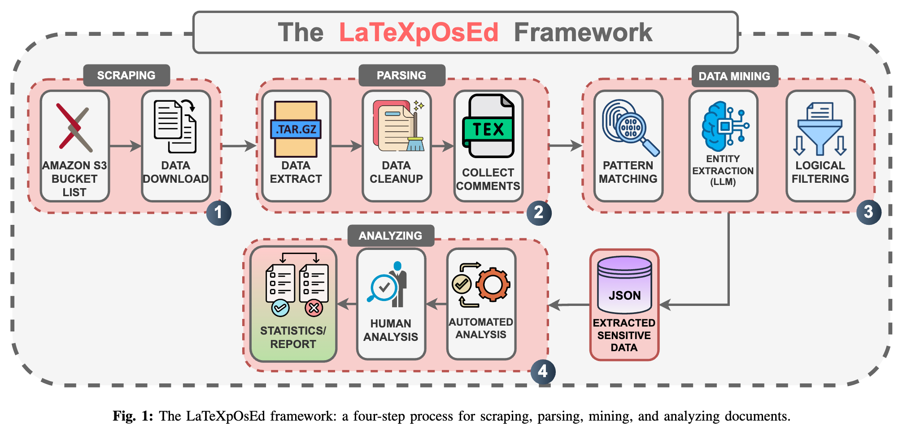

# You have been LaTeXpOsEd!

A Systematic Analysis of Information Leakage in Preprint Archives Using Large Language Models

## Abstract

The widespread use of preprint repositories such as arXiv has accelerated scientific communication but also introduced overlooked security risks. Beyond PDFs, these platforms provide unrestricted access to original source materials, including LaTeX sources, auxiliary code, figures, and embedded comments. In the absence of sanitization, submissions may disclose sensitive information that adversaries can harvest using open-source intelligence. In this work, we present the first large-scale security audit of preprint archives, analyzing more than 1.2 TB of source data from 100,000 arXiv submissions. Using a combination of traditional pattern matching and advanced large language models (LLMs), we detected contextually hidden sensitive data within non-referenced files and LaTeX comments. Our analysis uncovered thousands of PII leaks, GPS-tagged EXIF files, publicly available Google Drive and Dropbox folders, editable private SharePoint links, exposed GitHub and Google credentials, and cloud API keys. We also uncovered confidential author communications, internal disagreements, and conference submission credentials, exposing sensitive information that carries serious risks of reputational damage. Our results show that unsanitized source submissions pose serious risks affecting both researchers and institutions. We urge the research community and repository operators to take immediate action to close these hidden security gaps. To support open science, we release all scripts and methods from this study but withhold sensitive findings that could be misused, in line with ethical principles. The source code is available at https://github.com/LaTeXpOsEd.

## Methodology

1. Scrape archives in chunks from the S3 bucket hosted by arXiv.
2. Uncompress, filter, cleanup, extract relevant data and store in a common format.
3. Mine secret information using patter matching, entity extraction using LLMs and logical filtering techniques.
4. Analyze using LLMs and manual verification.

This repository contains the code used for each step:

1. Scraping: [ipynb](1_scrape.ipynb)
2. Parsing: [ipynb](2_parse.ipynb)
3. Data Mine: _pattern matching_ [ipynb](3_mine_pattern-matching.ipynb), _entity extraction_ [ipynb](3_mine_entity-extraction.ipynb), _logical filtering_ [ipynb](3_mine_logical-filter.ipynb)
4. Analyze: [ipynb](4_analyze.ipynb)

Ratio of papers without usable LaTeX comments.

## LLM SecDB Bechmark

We tested the accuracy of LLMs on secret detection on a custom-made dataset of 300 labeled text snippets containing various types to secret information.

- PII
- Credentials
- Network Identifiers
- Author Conflicts
- Peer reviews

We aim to find the most cost-effective model for this task. Our results are as follows:

LLM bechmark results

## Findings

All the findings summarized from all methods used.