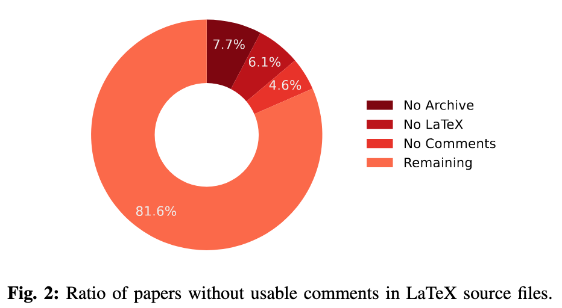
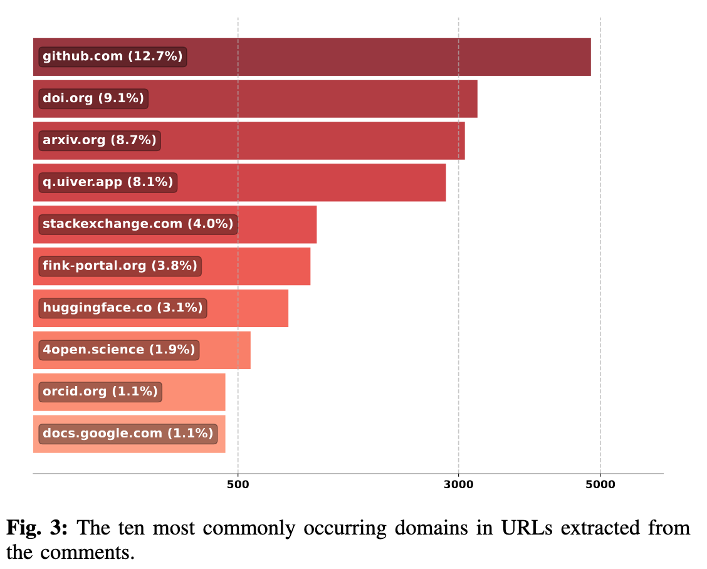
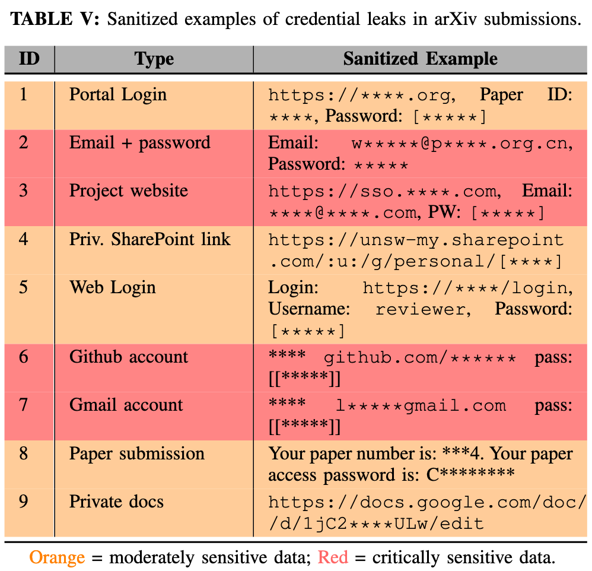

# You have been LaTeXpOsEd!

A Systematic Analysis of Information Leakage in Preprint Archives Using Large Language Models

<div align="center">
    
</div>

## Abstract

In this work, we present the first large-scale security audit of the arXiv preprint repository, analyzing over 1.2 TB of data from 100,000 arXiv submissions to report on systemic sensitive information leakage. When authors upload submissions, they publish not only a PDF but also auxiliary code, images, and LaTeX source files containing embedded comments. In the absence of sanitization, these files often disclose sensitive information that adversaries can harvest using open-source intelligence. Operating under a strict ethical framework of passive verification, we introduce LaTeXpOsEd, a pipeline that integrates pattern matching, logical filtering, and large language models (LLMs) to detect context-dependent secrets within LaTeX comments and unreferenced auxiliary files. To evaluate the secret-detection capability of LLMs, we introduce LLMSec-DB, a benchmark on which we tested 25 state-of-the-art models. Analyzing publicly available arXiv submissions, we uncover thousands of PII exposures, hundreds of instances of exposed credentials, private Google Drive links, API keys, and various semantic leaks, including internal disputes and confidential peer reviews. We show that this large-scale extraction of sensitive information is economically viable for low-resource adversaries leveraging open-weight models and constitutes a serious security and reputational threat to individuals and institutions. We urge the research community and repository operators to take immediate action to close these hidden security gaps. To support  open science and in accordance with responsible disclosure standards, we have published our toolset and benchmarks on GitHub: [https://github.com/LaTeXpOsEd](https://github.com/LaTeXpOsEd). For security and privacy reasons, sensitive findings have been anonymized to protect the confidentiality of individuals and institutions.

## Citation

Please cite the research the following way:

```bibtex
@misc{dubniczky2025latexposed,
      title={You Have Been LaTeXpOsEd: A Systematic Analysis of Information Leakage in Preprint Archives Using Large Language Models}, 
      author={Richard A. Dubniczky and Bertalan Borsos and Tihanyi Norbert},
      year={2025},
      eprint={2510.03761},
      archivePrefix={arXiv},
      primaryClass={cs.CR},
      url={https://arxiv.org/abs/2510.03761}, 
}
```

## Methodology


1. Scrape archives in chunks from the S3 bucket hosted by arXiv.
2. Uncompress, filter, cleanup, extract relevant data and store in a common format.
3. Mine secret information using patter matching, entity extraction using LLMs and logical filtering techniques.
4. Analyze using LLMs and manual verification.

This repository contains the code used for each step:

| ⚠️ Please note that running these scripts will incur costs on your AWS account and LLM inference provider.

1. Scraping: [ipynb](1_scrape.ipynb)
2. Parsing: [ipynb](2_parse.ipynb)
3. Data Mine: _pattern matching_ [ipynb](3_mine_pattern-matching.ipynb), _entity extraction_ [ipynb](3_mine_entity-extraction.ipynb), _logical filtering_ [ipynb](3_mine_logical-filter.ipynb)
4. Analyze: [ipynb](4_analyze.ipynb)

## LLM SecDB Bechmark

We tested the accuracy of LLMs on secret detection on a custom-made dataset of 300 labeled text snippets containing various types to secret information. 200 of the 300 samples contained some sensitive information. We categorize the findings into 5 groups:

- PII
- Credentials
- Network Identifiers
- Author Conflicts
- Peer reviews

We aim to find the most cost-effective model for this task. Our results are as follows:


LLM bechmark results

According to our results GPT 5 reaches the highest exact match accuracy with 82.7%, while Claude 3.7 Sonnet has the highest, at least one match accuracy with 92.0%. In our use-case, even a single match triggers a manual review so it is the more relevant metric. With that said, running the tests on the 100,000 sample we collected costs approximately \$850 to \$2000 with these top performing models. Qwen 2.5 72B, however, achieved 91.0% single accuracy score, only one percentage point lower than the top performing Claude 3.7 Sonnet, but with a fraction of the running cost of approximately \$47. Due to these factors, we selected Qwen 2.5 72B for the evaluation.

## Findings


All the findings summarized from all methods used. Approximately 9.9% of the papers were flagged for sensitive information.


<p align="center"></p>

- 7.7% of the papers were only PDFs, likely converted from docx files instead of LaTeX
- 6.1% of the papers contained an archive that had uploaded files, but no `.tex` files were present. These were likely invalid submissions
- 4.6% contained `.tex` files. but no comments were present. This indicates a systematic and automated removal of comments, as they were missing from the template files as well.
- 81.6% of the papers contained LaTeX comments

<p align="center"></p>

The most common domains point to other research, code repoitories and LLM providers which is to be expected. The 10. most common domain points to docs.google.com, where files can be shared without requiring a password.


<p align="center"></p>

Some examples from the cretentials that were found by entity extraction. Most of the exposed credentials we found point to work accounts, however, some grant access to private gmail or icloud accounts. We notified the affected users of leakage we deem critical and consulted them on the measures they can take to mitigate the disclosures.